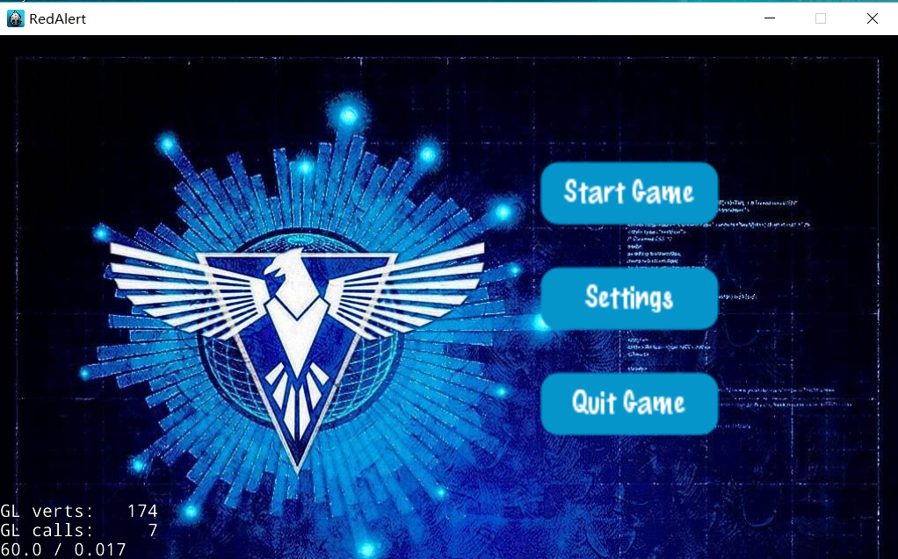
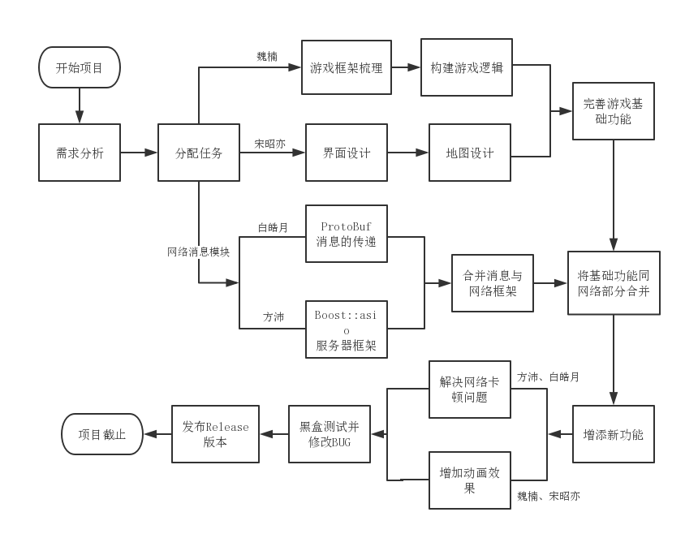
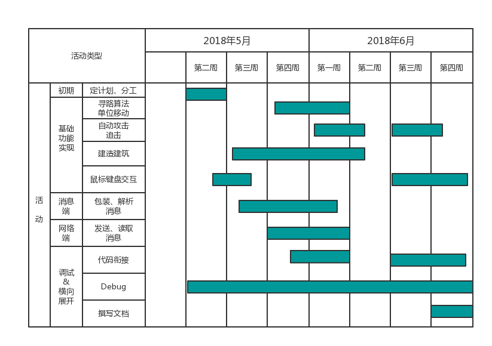

# RED ALERT
<!-- TOC -->

- [RED ALERT](#red-alert)
    - [游戏概述与游戏玩法](#游戏概述与游戏玩法)
        - [简介](#简介)
        - [游戏运行环境要求：](#游戏运行环境要求)
        - [游戏支持的操作](#游戏支持的操作)
        - [各兵种单位属性](#各兵种单位属性)
    - [游戏加载方式](#游戏加载方式)
        - [Server端口启动方式](#server端口启动方式)
        - [Client端口启动方式](#client端口启动方式)
    - [项目安排](#项目安排)
        - [项目分工及权值分配](#项目分工及权值分配)
        - [项目的开发流程](#项目的开发流程)
    - [评分项的完成度](#评分项的完成度)
        - [基础功能](#基础功能)
        - [基础功能外的可选功能](#基础功能外的可选功能)
    - [C++规范的使用](#c规范的使用)
        - [C++特性的使用](#c特性的使用)
        - [C++11新特性的使用](#c11新特性的使用)
    - [最后致谢](#最后致谢)

<!-- /TOC -->
## 游戏概述与游戏玩法
### 简介
Red Alert是一款即时战略(RTS)游戏，支持最多四人对战，可以实现局域网下的联机对抗，在游戏中玩家需要利用基地和各型建筑持续产生的资源来生产即战单位，在保证己方基地不被摧毁的前提下，摧毁敌方的基地以获得最终的胜利。


### 游戏运行环境要求：
* 运行平台：Windows
* 游戏最低硬盘空间：70 MB

### 游戏支持的操作

|支持的操作|对应的效果|
|:-:|:-:|
|点击主基地|呼出建造菜单|
|点击兵营|呼出警犬、士兵生产菜单|
|点击战车工厂|呼出坦克、战斗机生产菜单|
|鼠标置于屏幕边缘|当距离边缘10 ~ 40像素时移动地图，0 ~ 10像素时移动速度翻倍|
|点击小地图|地图移动至相应地点|
|点击建造菜单中的各建筑|再点击主基地建造范围内的合理地点可实现建造建筑|
|点击生产菜单中的各单位|实现在相应的建筑中生产单位|
|点击(框选)单位后再点击空地|单位将移动至该地点(若该点位于非可移动区域，将尽可能靠近该点)|
|点击(框选)单位后再点击敌方单位|单位将靠近该地方单位并发起攻击,若不可攻击则只靠近敌方单位|
|点击聊天框的InputBar,输入单行字符，再点击游戏地图上任何空地，敲下Enter键|发送消息，该消息对所有游戏玩家可见|
|按下Blank Space键|回到主基地|
|按下PgUp、PgDn、Left、Right键|将地图分别移动向上、下、左、右|

### 各兵种单位属性
|单位名|特性|攻击力|攻击间隔|血量|移动力|攻击范围|建造时长|建造代价|
|:-:|:-:|:-:|:-:|:-:|:-:|:-:|:-:|:-:|
|警犬|只对士兵发起攻击，一击致死|5|2|1|5|1|2|1|
|士兵|属性均衡|3|1|3|3|3|3|2|
|坦克|耐久力强，具有强大的火力|5|5|10|4|5|8|5|
|飞机|高机动性，破坏力极强|8|5|7|10|5|10|10|

## 游戏加载方式
### Server端口启动方式
1. 解压压缩包至硬盘
2. 打开`RedAlert.exe`后单击`Start Game`按钮
3. 单击`Create Game`进入Server界面
4. 选择一张地图作为游戏地图(默认选择`LostCity`作为游戏主地图)
5. 单击`Start Server`创建游戏服务端
6. 等待Client端玩家加入直至右端显示的连接人数达到2人及以上
7. 点击`Start Game`进入游戏场景

### Client端口启动方式
1. 执行Server端口启动方式的1、2两步
2. 单击`Join Game`进入房间列表
3. 在输入框中输入服务端的IPv4地址
4. 单击`Start Game`接入服务器
5. 等待Server端的响应，当Server段玩家发出游戏开始指令时进入游戏场景

## 项目安排
### 项目分工及权值分配
|成员|分工|得分权值|
|:-:|:-:|:-:|
|宋昭亦|地图设计、场景设计、素材收集、寻路移动|100%|
|白皓月|Google ProtoBuf与Boost::Asio、攻击算法、金钱电力类设计|100%|
|魏楠|单位与建筑类设计、游戏控制算法、游戏主体框架、动画制作|100%|
|方沛|Boost服务器编程、框选点选操作、小地图、键盘事件|100%|

### 项目的开发流程



## 评分项的完成度
### 基础功能
- [x] 地图绘制、建筑物绘制、兵种绘制
- [x] ⿏标和键盘操作交互 
- [x] 五种基本建筑物(基地，电⼚，矿场，兵营，战⻋⼯⼚）
- [x] 两种基本步兵(士兵，警犬)
- [x] 一种基本坦克(坦克)
- [x] ⽀持局域⽹联机对战(⾃由对抗模式)，且⽀持多⼈在同⼀个地图游戏
- [x] 动画效果(建造动画、警犬移动动画)

### 基础功能外的可选功能
- [x] 多个国家(不同国家的单位、建筑用不同颜色区分)
- [x] 支持飞机(可以跨越障碍物，起飞状态下可以重叠)
- [x] 支持聊天(目前只支持全局聊天)
- [x] 支持两张地图
- [x] 支持小地图(可以实现点击快速移动以及标注单位)

## C++规范的使用
### C++特性的使用
1. STL容器

`std::vector`贯穿于`GridMap`, `AStarPathFinding`与`Unit`之中
* `typedef std::vector<std::vector<int>> dyadic_array;`
```
dyadic_array是一个二维数组，用于记录格点是否被占用，并且标示占用该格点的单位id
```
* `typedef std::vector<GridPoint> GridPath;`
```
GridPath是个盛放GridPoint的数组，用于标示单位行走的路径，将单位的移动转化成最佳路径问题
```

`std::map`与`std::deque`
```
    typedef std::deque<chat_message> chat_message_queue;
	std::map<cocos2d::EventKeyboard::KeyCode, bool> keys;
```

2. 迭代器

迭代器在代码中的体现主要是配合STL容器的操作，如在`AStarPathFinding.cpp`中
```
void PathFinding::removeFromOpenList(Grid * grid)
{
	auto iter = find(_open_list.begin(), _open_list.end(), grid);
	if (iter != _open_list.end())
	_open_list.erase(iter);
}
```

3. 类和多态
* 该特性集中体现在`Unit.h`与`AdvancedUnit.h`中
* 所有的建筑的基类都是`Building`类，而`Building`类则继承自`Unit`类
* 所有的可移动单位都直接继承自`Unit`类
* `Fighter`类的`void move()`函数以及`Tank`类的`void attack()`函数则为override函数

4. 函数重载
```
class GridMap{
	bool occupyPosition(int id, const cocos2d::Point& pos, bool occupy_grid = true);
	bool occupyPosition(int id, const GridPoint& pos, bool occupy_grid = true);
};
```

5. 运算符重载
```
struct GridPoint{
	bool operator==(const GridPoint& gp2) const;
	friend GridPoint operator+(const GridPoint& gp1, const GridPoint& gp2);
	friend GridPoint operator-(const GridPoint& gp1, const GridPoint& gp2);
	friend GridPoint operator-(const GridPoint& gp, const GridSize& gz);
};
```

6. 异常
```
void TcpConnection::do_close()
{
	try {
		error_flag_ = true;
		chat_message empty_msg;
		memcpy(empty_msg.data(), "0001\0", 5);
		read_msg_deque_.push_back(empty_msg);
		std::cout << "before notify";
		data_cond_.notify_one();
		asio::error_code ec;
		socket_.shutdown(asio::ip::tcp::socket::shutdown_both, ec);
		if (!ec){
			throw asio::system_error(ec);
		}
		socket_.close();
	}
	catch (std::exception&e){
		e.what();
	}
}
```

### C++11新特性的使用
1. 初始化列表
```
Unit(int _max_life, int _atk_freq, double _atk_range, int _speed) 
		:max_life(_max_life), attack_frequency(_atk_freq), attack_range(_atk_range), speed(_speed), rec(GridRect{ 0,0 }){  }
```

2. 类型推断(auto)
```
非常非常多，不知道拿什么代表
```

3. 基于范围的for循环
```
//从PreLoad.plist中读取并加载精灵帧
void PreLoad::loadSpriteSheets(ValueVector spriteSheets) {
	auto a = SpriteFrameCache::getInstance();
	for (Value &v : spriteSheets) {
		string str = v.asString();		
		a->addSpriteFramesWithFile(str);
		progressUpdate();
	}
}
```

4. 智能指针
```
    typedef std::shared_ptr<TcpConnection> pointer;
	TcpConnection::pointer new_connection = TcpConnection::create(acceptor_.get_io_context(), this);
```

5. Lambda表达式
```
    //该函数使用sgn函数将向量表示成({-1,0,1},{-1,0,1})的形式
    GridPoint GridPoint::getDirectionVec()
    {
	    auto sgn = [](int x)->int { return x ? (x > 0 ? (1) : (-1)) : 0; };
	    return GridPoint(sgn(_x), sgn(_y));
    }

	void write(const chat_message& msg)
	{
		asio::post(io_context_,
			[this, msg]()
		{
			bool write_in_progress = !write_msgs_.empty();
			write_msgs_.push_back(msg);
			if (!write_in_progress)
			{
				do_write();
			}
		});
	}
```

6. 右值引用
```
    void do_accept()
	{
		acceptor_.async_accept(
			[this](std::error_code ec, tcp::socket socket)
		{
			if (!ec)
			{
				TcpConnection::pointer new_connection = TcpConnection::create(acceptor_.get_io_context(), this);
				connections_.push_back(new_connection);
				auto ep_ = socket.remote_endpoint();
				new_connection->get_socket(std::move(socket));
				std::cout << "client : " << ep_.port() << " enter this room" << std::endl;
				new_connection->start();
			}
			do_accept();
		});
	}
```

7. 字符串字面量
```
	ip_box->setText("127.0.0.1");
```

8. 函数绑定器
```
    this->button_thread_ = new std::thread(std::bind(&chat_server::loop_process, this));
```

## 最后致谢
* 感谢助教在群里对我们提出的问题做出的解答
* 感谢15级李坤学长为我们网络端编程提供的建议与帮助
* 感谢设计与创意学院某不愿透露姓名的同学给与的PS图像处理帮助
* 感谢帮我们内测版本提供回馈与建议的各同学和朋友们

School of Software Engineering, Tongji University, Shanghai